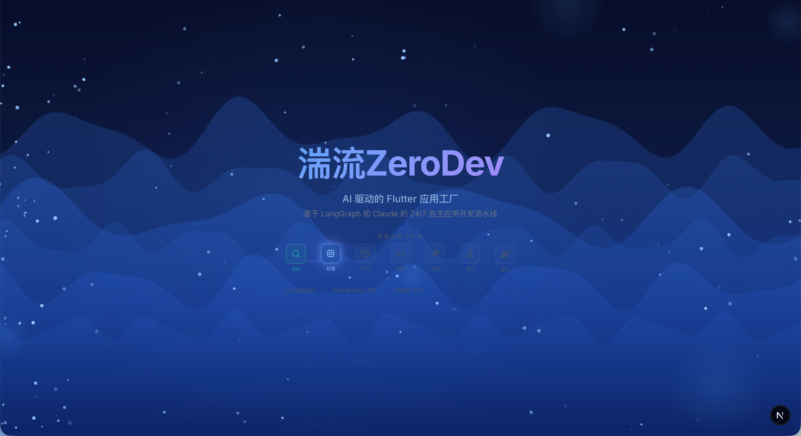
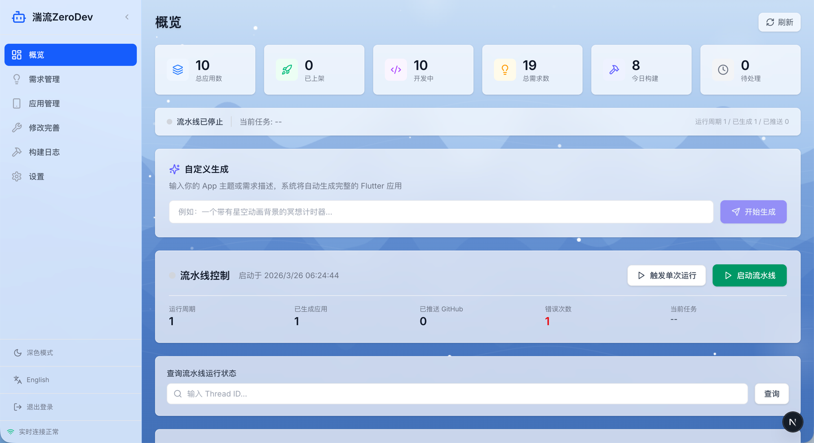

# 湍流ZeroDev

> **鸿蒙优先的自动化应用工厂。** 从互联网挖掘需求，AI 自动生成 Flutter 代码，**面向鸿蒙 HarmonyOS 7 自动产出原生 `.hap` 应用包**，同时覆盖 Android / iOS 三端，并自动上架应用商店。

ZeroDev 的核心定位是 **鸿蒙生态的应用规模化生产**：在国产操作系统加速发展的背景下，鸿蒙应用供给是关键缺口。本项目把"需求发现 → AI 生成 → 鸿蒙构建 → 上架"全链路自动化，让鸿蒙应用可以批量、低成本地生产。

生成的应用发布在: [shodan1q/zerogenerate](https://github.com/shodan1q/zerogenerate)





## 鸿蒙优先 (HarmonyOS First)

ZeroDev 把鸿蒙作为**第一目标平台**，而非附属端：

- **适配鸿蒙 7（HarmonyOS 7）**：生成的应用面向 HarmonyOS 7 / OHOS，通过 flutter-ohos 工具链真实产出 `.hap` 安装包。
- **鸿蒙兼容的代码生成约束**：强制 Dart 2.19 / Flutter 3.7+、Material Design 2，禁用 Dart 3.x 语法（super 参数、records、patterns、sealed classes）与 `ColorScheme.fromSeed()`，从源头保证 OHOS 兼容性。
- **可单独生产鸿蒙应用**：`zerodev generate --platform ohos` 即可只产出鸿蒙包，无需构建其它端（详见 [按平台构建](#按平台构建)）。
- **全自动鸿蒙流水线**：需求采集 → 评估 → 代码生成 → `flutter build hap --release` → 资源生成 → 上架，端到端无人工介入。

> 适配鸿蒙 7 的构建依赖本机的 flutter-ohos + DevEco / OpenHarmony SDK，配置方式见 [鸿蒙构建前置条件](#鸿蒙harmonyos构建前置条件)。

## 架构概览

系统采用五层流水线架构，由 LangGraph 有向图编排，支持 SQLite checkpoint 持久化与中断恢复：

```
┌─────────────────────────────────────────────────────────┐
│           Agent 调度中心 (Python + LangGraph)             │
│     StateGraph 有向图编排 + SQLite Checkpoint 持久化       │
│     指数退避重试 + 中断恢复 + 人工审核中断点                │
└──────┬─────────┬──────────┬──────────┬─────────┬────────┘
       │         │          │          │         │
       v         v          v          v         v
   ┌───────┐ ┌───────┐ ┌────────┐ ┌────────┐ ┌────────┐
   │ 需求   │ │ 评估   │ │ 代码   │ │ 构建   │ │ 运营   │
   │ 采集层 │ │ 决策层 │ │ 生成层 │ │ 发布层 │ │ 监控层 │
   └───────┘ └───────┘ └────────┘ └────────┘ └────────┘
```

主图：crawl -> process -> evaluate -> decide -> [人工审核] -> fan_out
子图：generate -> build -> assets -> [人工审核] -> publish

## 技术栈

| 层级 | 技术 |
|------|------|
| Agent 编排 | Python 3.11+ / LangGraph / SQLite Checkpoint |
| LLM | Claude Opus 4.6（官方 Anthropic SDK，支持 API Key 或 Max Plan OAuth Token） |
| 后端 API | FastAPI + Uvicorn |
| 实时通信 | WebSocket（自动重连，指数退避） |
| 前端 Dashboard | Next.js 15 + TypeScript + Tailwind CSS v4 |
| 移动端 | Flutter 3.7+ / Dart 2.19，**首要目标：鸿蒙 HarmonyOS 7 / OHOS（flutter-ohos 产出 .hap）**，兼顾 Android / iOS |
| 状态管理 | Riverpod 2.x |
| 数据库 | PostgreSQL + SQLAlchemy（异步） |
| 定时调度 | Celery Beat（可选） |
| 图标生成 | DALL-E 3 API |

## 快速开始

### 前置条件

- Python 3.11+
- Node.js 18+（Dashboard 前端）
- Flutter 3.7+（代码生成与构建）
- Flutter OHOS 社区版（可选，HarmonyOS 构建）
- PostgreSQL（需求数据库）
- Redis（可选，Celery 定时调度）

### 安装

```bash
# 克隆项目
git clone <repo-url> && cd zeroapp

# 安装 Python 依赖
make install

# 安装 Dashboard 前端依赖
cd dashboard && npm install && cd ..

# 复制并编辑环境变量
cp .env.example .env
# 编辑 .env，填入 Claude OAuth Token（推荐，Max Plan）或 API Key
```

### 配置

编辑 `.env` 文件，核心配置项：

- `CLAUDE_OAUTH_TOKEN`：Claude Pro/Max 订阅 OAuth Token，运行 `claude setup-token` 获取（优先级最高）
- `CLAUDE_API_KEY`：Anthropic 官方 API Key（未设置 OAuth Token 时使用）
- `CLAUDE_BASE_URL`：可选自建 API 网关地址，留空使用官方端点
- `CLAUDE_MODEL`：默认 `claude-opus-4-6`
- `DATABASE_URL`：PostgreSQL 异步连接字符串
- `PIPELINE_CHECKPOINT_BACKEND`：`sqlite`（推荐）或 `memory`

#### Claude 认证方式

项目通过官方 Anthropic SDK 接入，支持两种认证方式，**OAuth Token 优先于 API Key**：

| 方式 | 适用场景 | 配置项 | 成本 |
|------|----------|--------|------|
| OAuth Token（推荐） | Claude Pro/Max 订阅 | `CLAUDE_OAUTH_TOKEN` | 订阅内，无额外按量费用 |
| API Key | 按量付费 | `CLAUDE_API_KEY` | 按 token 计费 |

**订阅模式（OAuth Token）：**

```bash
claude setup-token        # 生成 sk-ant-oat-... 形式的订阅 token
# 将输出填入 .env 的 CLAUDE_OAUTH_TOKEN，CLAUDE_API_KEY 留空
```

- 客户端自动附加 `anthropic-beta: oauth-2025-04-20` 请求头。
- 订阅 token 直连 Messages API 要求 `system` 首块为 Claude Code 身份串，`zerodev/llm.py`
  会在 OAuth 模式下**透明注入**该块（原 system prompt 接其后），业务调用无需改动。
- 也可在 Dashboard「设置」页直接填写 OAuth Token / API Key。

`CLAUDE_BASE_URL` 留空使用官方端点；仅在使用自建 API 网关时填写。

### 运行

```bash
# 启动后端 API（端口 9716）
make dashboard

# 启动前端 Dashboard（端口 9717）
make dashboard-frontend

# 运行一次完整流水线
make generate-app

# 或使用 CLI
zerodev pipeline
```

### 按平台构建

支持单独或组合构建三端，平台标识：`android` / `ios` / `ohos`（鸿蒙 HarmonyOS）。

选择优先级：**CLI `--platform` > 配置 `TARGET_PLATFORMS` > 默认 `android`**。三处入口：

```bash
# CLI：仅构建鸿蒙
zerodev generate --platform ohos

# CLI：安卓 + 鸿蒙
zerodev pipeline run --platform android,ohos

# 配置默认值（.env）
TARGET_PLATFORMS=ohos

# Dashboard：设置页「构建平台」多选
```

各平台产物：`android` → APK + AAB；`ios` → IPA；`ohos` → HAP。
请求的多个平台中只要有一个成功即继续，失败平台记录在日志中。

#### 鸿蒙（HarmonyOS）构建前置条件

目标系统为 **HarmonyOS 7（OHOS）**。鸿蒙构建会真实调用 flutter-ohos 工具链产出 `.hap`，需在本机准备对应 HarmonyOS 7 的 SDK：

| 配置项 | 说明 |
|--------|------|
| `FLUTTER_OHOS_PATH` | flutter-ohos 分支 SDK 路径（其 `bin/flutter` 负责 `build hap`） |
| `DEVECO_SDK_HOME` | DevEco Studio SDK 路径 |
| `OHOS_SDK_HOME` | OpenHarmony SDK 路径 |

构建流程：自动补齐 `ohos/` 模块（`flutter create --platforms ohos`）→ `flutter build hap --release` →
定位 `.hap` 产物（优先已签名）。release 签名需在 `ohos/` 工程内配置华为开发者证书。
环境未就绪时该平台会返回明确失败（与 iOS 依赖 Xcode 同理），不影响其它平台。

## 项目结构

```
zeroapp/
├── zerodev/                    # Python 主包
│   ├── api/                    # FastAPI 后端（路由、WebSocket、事件）
│   ├── assets/                 # 资源生成（图标、截图、商店文案）
│   ├── builder/                # Flutter 构建与发布
│   ├── crawler/                # 需求采集爬虫
│   ├── evaluator/              # 需求评估与决策
│   ├── generator/              # 代码生成（PRD、模板、逐文件生成）
│   │   └── templates/          # Flutter 项目模板注册表
│   ├── models/                 # SQLAlchemy 数据模型
│   ├── monitor/                # 运营监控
│   ├── pipeline/               # LangGraph 流水线（图、状态、checkpoint、重试）
│   ├── tasks/                  # Celery 异步任务
│   ├── config.py               # 配置（pydantic-settings）
│   ├── database.py             # 数据库引擎
│   ├── llm.py                  # Claude 客户端（官方 SDK，API Key / OAuth Token 双认证）
│   └── main.py                 # CLI 入口（typer）
├── dashboard/                  # Next.js 15 前端
├── alembic/                    # 数据库迁移
├── tests/                      # 测试
├── workspace/                  # 生成的 Flutter 项目（git 忽略）
├── data/                       # SQLite checkpoint 数据（git 忽略）
├── pyproject.toml              # Python 项目配置
├── Makefile                    # 常用命令
└── flutter_agent_requirements.md  # 完整需求清单
```

## CLI 命令

```bash
zerodev run              # 启动完整流水线（持续运行）
zerodev crawl            # 仅运行需求采集
zerodev evaluate         # 评估待处理需求
zerodev generate         # 为已通过需求生成代码
zerodev build            # 构建已通过的应用
zerodev pipeline         # 运行一次完整流水线
```

## API 端点

| 端点 | 方法 | 说明 |
|------|------|------|
| `/ws` | WebSocket | 实时事件推送 |
| `/api/dashboard` | GET | 概览统计数据 |
| `/api/demands` | GET | 需求列表（分页、状态/来源筛选） |
| `/api/demands/{id}` | GET | 需求详情 |
| `/api/demands/{id}/approve` | POST | 审批需求 |
| `/api/demands/{id}/reject` | POST | 驳回需求 |
| `/api/apps` | GET | 应用列表（分页、搜索、状态筛选） |
| `/api/apps/{id}` | GET | 应用详情 |
| `/api/apps/{id}/rebuild` | POST | 重新构建 |
| `/api/builds` | GET | 构建日志 |
| `/api/stats` | GET | 统计数据（收入、评分、日活） |
| `/api/generated-apps` | GET | 已生成的 Flutter 项目列表 |
| `/api/generated-apps/revise` | POST | AI 修改现有应用 |
| `/api/settings` | GET | 获取系统设置 |
| `/api/settings` | POST | 保存系统设置 |
| `/api/pipeline/status/{thread_id}` | GET | 流水线状态 |
| `/api/pipeline/trigger` | POST | 触发单次流水线 |
| `/api/pipeline/start` | POST | 启动持续流水线 |
| `/api/pipeline/stop` | POST | 停止持续流水线 |
| `/api/pipeline/generate-custom` | POST | 自定义主题生成 App |
| `/api/pipeline/runner-status` | GET | 流水线运行状态 |
| `/api/pipeline/logs` | GET | 流水线日志 |
| `/api/devices/status` | GET | 模拟器/真机状态 |
| `/api/apps/run` | POST | 在设备上运行 App |

后端默认端口：9716，前端默认端口：9717。

## Dashboard 使用

Dashboard 是独立的 Next.js 15 前端应用，通过 API 连接 FastAPI 后端。采用全屏水流动画背景 + 毛玻璃卡片设计。

功能模块：
- **概览** -- 统计卡片、流水线控制（启动/停止/单次触发）、自定义生成、实时日志
- **需求管理** -- 需求列表、状态/来源筛选、分页、审批/驳回、详情展开
- **应用管理** -- 应用列表、搜索、设备运行（Android/iOS/HarmonyOS）、重构建
- **修改完善** -- 选择已生成应用、输入修改指令、AI 自动修改代码并提交
- **构建日志** -- 构建记录、状态筛选、展开输出/错误详情
- **设置** -- Claude API 配置、流水线参数、数据源开关、发布密钥管理

启动方式：
```bash
# 终端 1：后端
make dashboard

# 终端 2：前端
make dashboard-frontend
```

## 开发指南

### 测试

```bash
# Python 测试
make test

# 全部测试（Python + 前端类型检查）
make test-all
```

### 代码检查

```bash
# 检查
make lint

# 自动格式化
make format

# 类型检查
make typecheck
```

### 构建

```bash
# Android APK
make build-android

# iOS IPA
make build-ios

# HarmonyOS HAP（需配置 OHOS SDK 环境变量）
make build-ohos
```

### 代码生成兼容性

代码生成目标为 Dart 2.19 / Flutter 3.7+，以确保 HarmonyOS OHOS 兼容性。生成的代码禁止使用以下 Dart 3.x 特性：
- super 参数（使用 `Key? key` + `super(key: key)` 风格）
- records、patterns、sealed classes
- `colorSchemeSeed` / `ColorScheme.fromSeed()`
- Material Design 3（统一使用 `useMaterial3: false`）

### 代码生成流水线

采用两阶段生成架构：

1. **蓝图阶段** -- 一次性生成所有文件的骨架（类定义、方法签名、import）
2. **实现阶段** -- 逐文件生成完整实现，携带蓝图和已完成文件作为上下文

### 自动修复管道

生成后自动执行 12 项修复，确保代码编译通过：

1. Markdown 围栏清理（处理前导文本等边缘情况）
2. pubspec.yaml 验证与修复（版本、SDK 约束）
3. Android AdMob 配置（AndroidManifest.xml）
4. MobileAds 异步初始化修复
5. iOS AdMob 配置（Info.plist）
6. Dart 3.x `super.key` 转换为 Dart 2.19 `Key? key` 风格
7. 缺失 import 自动检测（覆盖 40+ 常用库）
8. Provider 类自动继承 ChangeNotifier
9. CardTheme -> CardThemeData 类型修复
10. Gradle core library desugaring
11. 项目内部 import 自动解析（扫描类/枚举定义并补全 import）
12. package 名称不匹配修复（pubspec name vs 目录名）

修复后自动运行 `dart analyze`，如有剩余错误则调用 Claude 进行最多 3 轮修复。

### LLM 容错机制

Claude API 调用内置重试机制：
- 超时（ReadTimeout）、连接超时、服务器 500 错误自动重试
- 每次重试等待 60 秒
- 最多 3 次重试
